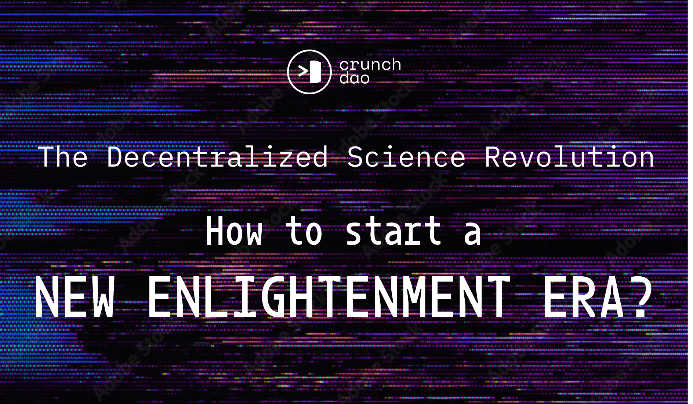

# desci

<div align="center">

[](https://github.com/crunchdao/desci-framework/actions?query=workflow%3Abuild)
[](https://github.com/crunchdao/desci-framework/pulls?utf8=%E2%9C%93&q=is%3Apr%20author%3Aapp%2Fdependabot)

[](https://github.com/psf/black)
[](https://github.com/PyCQA/bandit)
[](https://github.com/crunchdao/desci-framework/blob/main/.pre-commit-config.yaml)
[](https://github.com/crunchdao/desci-framework/releases)
[](https://github.com/crunchdao/desci-framework/blob/main/LICENSE)

`desci` is the Python package for Decentralized Science by [CrunchDAO](https://www.crunchdao.com/)

</div>

## Description

CrunchDAO is a Decentralized Autonomous Organization of scientists making use of collective intelligence to solve complex problems, powered by a tokenomics.

We are here proposing a Decentralized Science Framework, making use of git and IPFS, that enables every group of scientists to collaborate on a single Unit of Knowledge, avoiding the so-called tragedy of anticommons, using the principles of continuous integration/continuous delivery, in a way that also tackles the reproducibility crisis in science.

The use of IPFS enables the integration and recognition of micropublications and the setup of a retroactive funding framework. Moreover, it makes it possible to build around the concept of machine readability, and self describing metadata, as the technology has the capacity to make digital goods immutable, transparent, externally provable, decentralized, and distributed.

Removing the need to write papers using only PDFs, it is possible to integrate multimedia contents, fostering outreach and education.

The latest PDF version of this project, automatically generated with git every time a merge request is validated by CrunchDAO, can be accessed at [desci.crunchdao.com](https://desci.crunchdao.com/). We will soon setup a bounty system for working on the project and a voting system to approve/reject updates of the white paper.

## Vision

[](https://www.youtube.com/watch?v=NLCy99WyIc0&t=665s)


## Tutorial

[](https://www.youtube.com/watch?v=tsPmvGHMxrk)

## Installation

[`Makefile`](https://github.com/crunchdao/desci/blob/main/Makefile) contains functions for faster development.

<details>
<summary>1. Install all dependencies and pre-commit hooks</summary>
<p>

```bash
make install
```

</p>
</details>

<details>
<summary>2. Codestyle</summary>
<p>

Automatic formatting uses `pyupgrade`, `isort`, and `black`.

```bash
make codestyle

# or use synonym
make formatting
```

Codestyle checks only, without rewriting files:

```bash
make check-codestyle
```

> Note: `check-codestyle` uses `isort`, `black` and `darglint` library

Update all dev libraries to the latest version using one command

```bash
make update-dev-deps
```
</details>

<details>
<summary>3. Cleanup</summary>
<p>
Delete pycache files

```bash
make pycache-remove
```

Remove package build

```bash
make build-remove
```

Delete .DS_STORE files

```bash
make dsstore-remove
```

Remove .mypycache

```bash
make mypycache-remove
```

Or to remove all above run:

```bash
make cleanup
```

</p>
</details>

## Credits [](https://github.com/TezRomacH/python-package-template)

This project was generated with [`python-package-template`](https://github.com/TezRomacH/python-package-template)
