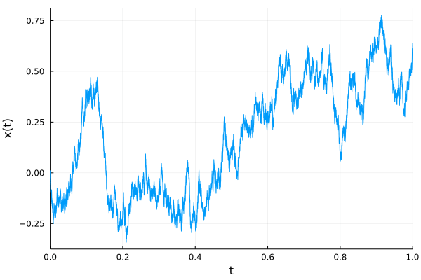

# List of contributors

| Full Name | Github @ | Discord @ | Date |
|----------|:---------------:|:-----------------:|------------|
| Matteo Manzi | matteoettam09 | matteoettam09#9362 | 2022/08/27 |
|Enzo Caceres | Caceresenzo | Enzo Caceres#4224 | 2022/08/28 |
|||||
|||||
|||||

\newpage

# A Decentralized Science framework 

## DeSci: an Overview

"Decentralized Science (DeSci), which recently came into play, refers to the communities of scientists, builders, advocates, and organizers that create infrastructure and advocate for distributed coordination to support scientific progress. It can advance the conditions of scientists worldwide and creates systems for scientists to recapture the value they create. Even in science, the success of a decentralised ecosystem depends on the community incentives structure and the microeconomy created around these incentives"\footnote{\url{https://desci.com/roadmap}}.

In the setup of this framework, a number of existing projects have been used as references for guiding our design choices. While in our context
this infrasctructure should enable us to collaborate, to avoid the so-called [tragedy of the anticommons](https://en.wikipedia.org/wiki/Tragedy_of_the_anticommons) and to always be reproducible, and this is a mean for us as a DAO to perform well in the financial market, the scope of this project is much broader and its potential in the public sector should not be neglected. Worth mentioning, for example, [the General Index](https://archive.org/details/GeneralIndex), and [Impact Certificates](https://impactmarkets.io/). -->

The entry point for us has been [DeSci Labs](https://desci.com/), and their work on the development of DeSci Nodes, a new unit of knowledge going beyond PDF: "DeSci Nodes creates an inventory of research artifacts, an incentive system for replication, a mechanism for validation, and a connection point embedded into your preprint."

Our design choices have also been driven by the lessons learned by Open Science, and Open-source Software Development: the ["Open Journals"](https://github.com/openjournals) organization, on which also the [Julia Ecosystem](https://juliacon.github.io/proceedings-guide/author/) is building on, is the most relevant here.

One of the requirements here was to go beyond traditional peer review, using Web3 technologies. The reference project, for this, has been Ants-Review [[@Antsreview]](https://arxiv.org/pdf/2101.09378.pdf): "peer-review is a necessary and essential quality control step for scientific publications, but it lacks adequate incentives. In fact, the process, which is very costly in terms of time and intellectual investment, is not only not remunerated by journals, but is not even openly recognized by the academic community as a relevant scientific achievement for a researcher. Therefore, scientific dissemination suffers in terms of timeliness, quality and fairness."

Other reference projects have been PRINCIPIA\footnote{See also \url{https://cordis.europa.eu/article/id/422224-principia-a-new-peer-review-platform-is-here}} [[@principia]](https://arxiv.org/pdf/2008.09011.pdf) and the "Peer Review" repository\footnote{\url{https://github.com/danielBingham/peerreview}}.

Other interesting projects, in the space, are [Lateral](https://www.lateral.io/), working on the construction of knowledge graphs, [Radicle](https://radicle.xyz/), building on Git and Ethereum to "enable developers to collaborate on software over a peer-to-peer network", [DeSci World](https://desci.world/), looking into the use of Non-Fungible Tokens for science.

## Design Choices

We are here proposing a DeSci framework, making use of IPFS, that can help perform research, outreach and education.

The first requirements has been to expose the user as little as possible to LaTeX, giving the possibility to write in Markdown, a language developed by John Gruber and Aaron Swartz: the backend takes care of generating the unit of knowledge (not necessarily a PDF), using *pandoc*.

The paper backend lives in a repository\footnote{https://github.com/crunchdao/desci} also containing a Python package: in this way the  symbiosys between codes and plain language can be leveraged to foster reproducibility. For example, there is a command called ```desci helloplot```:

```python
    """Hello Plot."""
    # evenly sampled time at 200ms intervals
    t = np.arange(0., 5., 0.2)

    # red dashes, blue squares and green triangles
    plt.plot(t, t, 'r--', t, t**2, 'bs', t, t**3, 'g^')
    plt.savefig('figures/helloplot.png')
```

 which can be used to produce the contents of the paper (Figure \ref{fig:helloplot}):

 

The paper is generated, using a docker image\footnote{https://hub.docker.com/r/crunchdao/desci-pandoc}, by the Actions of our repository: in this way the principles of Continuous Integration/Continuous Development not only apply to software, but also to the overlying scientific unit of knowledge.

In fact, currently, scientists must be trusted to provide a true and useful representation of their research results in their final publication; blockchain would make much larger parts of the research cycle open to scientific self-correction. This bears the potential to be a technical solution to the current reproducibility crisis in science, and could reduce waste and make more research results true 
[@Bartling2019].

Finally, an intiutive User Interface is setup at \url{https://desci.crunchdao.com/}: contributors of these units of knowledge don't have to be skilled software developer. If you nevertheless prefer to work on your editor, you can work on a new branch and then open a pull request at the public repository \url{https://github.com/crunchdao/desci}.

It is therefore possible to make use of IPFS to create an immutable copy of each version [@Tenorio2018]: the IPFS nodes mirror the evolution of the main *git* branch. This enables the integration and recognition of micropublications and the setup of a retroactive funding framework. Moreover, this makes it possible to build around the concept of machine readability, and self describing metadata. As the technology has the capacity to make digital goods immutable, transparent, externally provable, decentralized, and distributed.

Finally, removing the need to write papers using PDFs, it is possible to integrate multimedia contents in the, fostering outreach and education.




In the context of CrunchDAO, the incentive structure is implicit in the fact that, challeging problematic assumptions in the hedge fund model, its performance increases, leading to the an increase in the value of the DAO (See [next Section](#crunchdao)). This integration of the hedge fund and the DAO is crucial to mitigate major flows of other Crowdsourced Investment frameworks [[@openscience]](https://doi.org/10.1177/0306312718772086)\footnote{Also tackling issues associated with the current public funding of science [[@Buterin_2019]](https://arxiv.org/abs/1809.06421)}. As an example, the introduction of the True Contribution at Numerai\footnote{\url{https://medium.com/numerai/alien-stock-market-intelligence-numerais-true-contribution-6bc7652bd6ac
}} has the risk of detaching the hedge fund and the community members, i.e. the tournament players (more on this in Subsection ["Metamodeling Layer 1"](#mml1)).

\newpage

# CrunchDAO {#crunchdao}

CrunchDAO is a market-neutral hedge-fund powered by a Decentralized Autonomous Organization of data scientists. The vision, to make use of collective intelligence to solve complex problems, is powered by a solid tokeconomics which enables the DAO to do well when the hedge fund does well (Figure \ref{fig:vc}).


- Discuss "Crowdsourced Investment Research Through Tournaments" and Lopez de Prado more in general here;

- Introduce the steps: Tournament, Layer 1, Layer 2, Portfolio Optimization in CrunchDAO.

## The Tournament

- Scoring function: [Spearman's rank correlation coefficient](https://en.wikipedia.org/wiki/Spearman%27s_rank_correlation_coefficient), OWEN

- Quantization

- Anonimization.

## Metamodeling Layer 1 {#mml1}

There is a need to align the incentives of the DAO members with the hedge fund. Tournament players cannot build their model on some data aiming at maximizing 
a correlation score when the hedge fund pays based on a different metric: if we want to treat tournament players fairly, we have to give them access to the metamodel, so that they can adjust their goal to the maximization of the True Contribution. We are assuming that metric is the best objective, at the tournament level, that maximizes the long term performance of the hedge fund. 

- There should be reinforcement learning frameworks that are agnostic wrt this low level objective, which is evolving with the model in the maximization of a score. This is much better.

- Understanding and documenting Udit and Emanuele.

-  [Idiosyncratic Risk](https://www.investopedia.com/terms/i/idiosyncraticrisk.asp);
-  [Sharpe Ratio](https://www.investopedia.com/terms/s/sharperatio.asp);

## Metamodeling Layer 2

CrunchDAO makes use of different datasets.

- C-MECHANICS
- E-KINETIC
- B-VOLATILITY
- 3B1-SIGNAL
- DOLLY
- GORDON-GEEKO

- How can people add different datasets? Mention [Weavechain](https://www.weavechain.com/) and DeSci Collaborative Data, and https://oceanprotocol.com/

- Discuss how all the metamodels are combined.

## Portfolio Optimization

- [Convex Optimization](https://en.wikipedia.org/wiki/Concavification), but keep also in mind [Convexification](http://larsblackmore.com/publications.htm) done in space: I would expect here to have something similar, if not more non-convex.

- Targets defined by [Barra Risk Factor Analysis](https://www.investopedia.com/terms/b/barra-risk-factor-analysis.asp);

<!-- # Messy notes

In the DeSci section, discuss about this: https://scholarlykitchen.sspnet.org/2022/08/29/a-new-ostp-memo-some-initial-observations-and-questions/

Filter these in the subsections below:

- Kind of council of elders of top crunchers: identify and engage top scientific profile from the community 
- Allow elders to interact with the research paper in a DeSci way 
- Orchestrate the call for signal and Cherry peek the best signals 

- Work on the definition of KPIs. Some ideas: 
    - Number of interaction on the paper
    - Median signal performance (Sharpe, ROI, DD)
    - Number of interaction with the podcasts.
    - Some way to evaluate the engagement of the syndacate.

Strategy KPI?

- KPIs
    - MM Sharpe
    - Backtest
        - MM ROI - backtest
        - MM DD - backtest
        - Competition OWEN and Spearman

At the beginning, we could gift an NFT? to people we want as advisors and having one leads to being able to give a feedback on the paper. See [here](https://desci.world/). This will allow people to join the 

- [ ] Mathematical syndicate 
- [ ] Seldonian Council (after Hari Seldon, Asimov, the developer of psychohistory) 
- [ ] Seldonian Foundation
- [ ] The Psychohistorians.

Then we vote with tokens to decide whether the pull request on the paper is accepted or not. Voting on the papers shall become part of civil duties. How will be individual decisions be integrated into the final one? More token more power, one head one vote? Or something fancy like ["A Flexible Design for Funding Public Goods"](https://arxiv.org/abs/1809.06421). Or something like [this](https://www.bretthennig.com/reinvigorating_democracy_through_random_selection)?

What is the role of SBTs here? Decentralized Society: Finding Web3’s Soul.

The outcome of the peer review changes your grade in the DAO which changes your access to the APY, Alternative idea, you stake on the pull request and if it is bad you lose.

- Implement in Python the pipeline that we use in the backend for the computation of the performance and the population -->

# References
