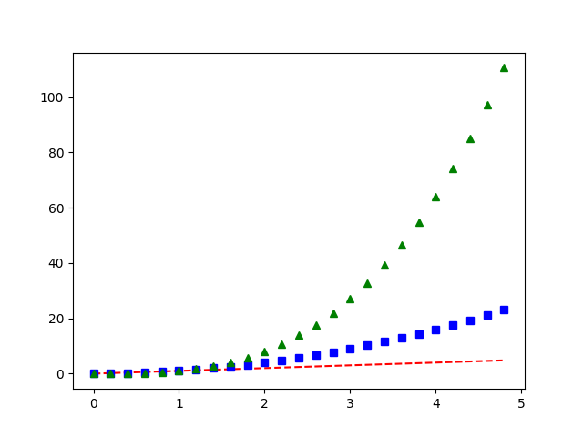

# List of contributors

| Full Name | Github @ | Discord @ | Date |
|----------|:---------------:|:-----------------:|------------|
| Matteo Manzi | matteoettam09 | matteoettam09#9362 | 2022/08/27 |
|Enzo Caceres | Caceresenzo | Enzo Caceres#4224 | 2022/08/28 |
|Someone | Someting | SOmething else | Today|
|||||
|||||

\newpage

# A Decentralized Science (DeSci) Framework 

## DeSci: an Overview

"[Decentralized Science (DeSci)](https://desci.com/roadmap), which recently came into play, refers to the communities of scientists, builders, advocates, and organizers that create infrastructure and advocate for distributed coordination to support scientific progress. It can advance the conditions of scientists worldwide and creates systems for scientists to recapture the value they create. Even in science, the success of a decentralized ecosystem depends on the community incentives structure and the microeconomy created around these incentives".

In the setup of this framework, several existing projects have been used as references for guiding our design choices. While in our context
this infrastructure should enable us to collaborate, to avoid the so-called [tragedy of the anticommons](https://en.wikipedia.org/wiki/Tragedy_of_the_anticommons), and always be reproducible, and this is a means for us as a DAO to perform well in the financial market, the scope of this project is much broader and its potential in the public sector should not be neglected. Worth mentioning, for example, [the General Index](https://archive.org/details/GeneralIndex), and [Impact Certificates](https://impactmarkets.io/).

The entry point for us has been [DeSci Labs](https://desci.com/), and their work on the development of DeSci Nodes, a new unit of knowledge going beyond PDF: "DeSci Nodes creates an inventory of research artifacts, an incentive system for replication, a mechanism for validation, and a connection point embedded into your preprint."

Our design choices have also been driven by the lessons learned by Open Science, and Open-source Software Development: the ["Open Journals"](https://github.com/openjournals) organization, on which also the [Julia Ecosystem](https://juliacon.github.io/proceedings-guide/author/) is building on, is the most relevant here.

One of the requirements here was to go beyond traditional peer review, using Web3 technologies. The reference project, for this, has been Ants-Review [[@Antsreview]](https://arxiv.org/pdf/2101.09378.pdf): "peer-review is a necessary and essential quality control step for scientific publications, but it lacks adequate incentives. In fact, the process, which is very costly in terms of time and intellectual investment, is not only not remunerated by journals but is not even openly recognized by the academic community as a relevant scientific achievement for a researcher. Therefore, scientific dissemination suffers in terms of timeliness, quality, and fairness."

Other reference projects have been [PRINCIPIA](https://cordis.europa.eu/article/id/422224-principia-a-new-peer-review-platform-is-here) [[@principia]](https://arxiv.org/pdf/2008.09011.pdf) and the "[Peer Review](https://github.com/danielBingham/peerreview)" repository.

Other interesting projects, in the space, are [Lateral](https://www.lateral.io/), working on the construction of knowledge graphs, [Radicle](https://radicle.xyz/), building on Git and Ethereum to "enable developers to collaborate on software over a peer-to-peer network", [DeSci World](https://desci.world/), looking into the use of Non-Fungible Tokens for science.

## Design Choices

We are here proposing a DeSci framework, making use of IPFS, that can help perform research, outreach, and education.

The first requirement has been to expose the user as little as possible to LaTeX, giving the possibility to write in Markdown, a language developed by John Gruber and Aaron Swartz: the backend takes care of generating the unit of knowledge (not necessarily a PDF), using *pandoc*.

The paper backend lives in [this repository](https://github.com/crunchdao/desci) also containing a Python package: in this way, the symbiosys between codes and plain language can be leveraged to foster reproducibility. For example, there is a command called ```desci helloplot```:

```python
    """Hello Plot."""
    # evenly sampled time at 200ms intervals
    t = np.arange(0., 5., 0.2)

    # red dashes, blue squares, and green triangles
    plt.plot(t, t, 'r--', t, t**2, 'bs', t, t**3, 'g^')
    plt.savefig('figures/helloplot.png')
```

 which can be used to produce the contents of the paper (Figure \ref{fig:helloplot}):

 

The paper is generated, using a [docker image](https://hub.docker.com/r/crunchdao/desci-pandoc), by the Actions of our repository: in this way, the principles of Continuous Integration/Continuous Development not only apply to software but also to the overlying scientific unit of knowledge.

In fact, currently, scientists must be trusted to provide a true and useful representation of their research results in their final publication; blockchain would make much larger parts of the research cycle open to scientific self-correction. This bears the potential to be a technical solution to the current reproducibility crisis in science and could reduce waste and make more research results true [@Bartling2019].

Finally, an intuitive User Interface will be set up at [desci.crunchdao.com](https://desci.crunchdao.com/): contributors of these units of knowledge won't have to be skilled software developers. If you nevertheless prefer to work on your editor, you can work on a new branch and then open a pull request at the public repository \url{https://github.com/crunchdao/desci}.

It is therefore possible to make use of IPFS to create an immutable copy of each version [@Tenorio2018]: the IPFS nodes mirror the evolution of the main *git* branch. This enables the integration and recognition of micropublications and the setup of a retroactive funding framework. Moreover, this makes it possible to build around the concept of machine readability, and self-describing metadata, as the technology has the capacity to make digital goods immutable, transparent, externally provable, decentralized, and distributed.

Finally, by removing the need to write papers using PDFs, it is possible to integrate multimedia contents, fostering outreach and education. If you are reading this from the PDF, you are missing some nice animations about chaos theory and stochastic modeling. The good news is, we already have a preliminary HTML version of this paper [here](https://htmlpreview.github.io/?https://github.com/crunchdao/desci/blob/main/paper/paper.html): enjoy!

<!-- 

 -->

In the context of CrunchDAO, the incentive structure is implicit in the fact that, challenging problematic assumptions in the metamodeling and portfolio optimization, i.e., all the steps between the tournament and the production of a signal, increases its performance, leading to an increase in the value of the DAO in the market (See [next Section](#crunchdao)). This integration is crucial to mitigate major flows of other Crowdsourced Investment frameworks [[@openscience]](https://doi.org/10.1177/0306312718772086), also tackling issues associated with the current public funding of science [[@Buterin_2019]](https://arxiv.org/abs/1809.06421). As an example, the introduction of the [True Contribution at Numerai](https://medium.com/numerai/alien-stock-market-intelligence-numerais-true-contribution-6bc7652bd6ac) has the risk of leading to an ill-defined the tournament, as its players are in this way incentivised to converge to the Nash equilibrium of an imperfect information game, whose rules change as a function of the behaviour of the other tournament players (more on this in Subsection ["Metamodeling Layer 1"](#mml1)).

\newpage

# CrunchDAO {#crunchdao}

CrunchDAO is a Decentralized Autonomous Organization of scientists making use of collective intelligence to solve complex problems, powered by a solid tokeconomics (Figure \ref{fig:vc}).


- "Crowdsourced Investment Research Through Tournaments" to be discussed in this section;

- Introduce the steps: Tournament, Layer 1, Layer 2, Portfolio Optimization in CrunchDAO.

## The Tournament

- Scoring function: [Spearman's rank correlation coefficient](https://en.wikipedia.org/wiki/Spearman%27s_rank_correlation_coefficient), OWEN

### Data 

- Quantization & Anonimization.

- [Weavechain](https://www.weavechain.com/): [arweave](https://www.arweave.org/) and [filecoin](https://filecoin.io/) make use of IPFS, they do not. Data do not go on chain. 

- Homomorphic Encryption links [here](https://github.com/microsoft/EVA) and [here](https://github.com/microsoft/SEAL), CKKS [here](https://blog.openmined.org/ckks-explained-part-1-simple-encoding-and-decoding/).

- [Federated learning](https://en.wikipedia.org/wiki/Federated_learning) + [Ocean Protocol](https://oceanprotocol.com/) for new datasets.

- Confidential Computing: [paper](https://arxiv.org/abs/2110.01390) and [repo](https://github.com/data61/MP-SPDZ) discussing SPDZ.

- [PySyft](https://github.com/OpenMined/PySyft): Syft allows a Data Scientist to ask questions about a dataset and, within privacy limits set by the data owner, get answers to those questions, all without obtaining a copy of the data itself.

- [Zero-knowledge proof](https://en.wikipedia.org/wiki/Zero-knowledge_proof)

## Metamodeling Layer 1 {#mml1}

There is a need to align the incentives of the single tournament players with the DAO as a whole. Tournament players cannot build their model on some data aiming at maximizing a correlation score when the DAO pays based on a different metric: if we want to treat tournament players fairly, we have to give them access to the metamodel, so that they can adjust their goal to the maximization of the True Contribution. We are assuming that such metric is the best objective, at the tournament level, that maximizes the long-term performance of the signal produced by the DAO. Moreover, there is alredy a problematic assumption in splitting this optimization problem into a sequence of two optimization problems. More research is necessary.

## Metamodeling Layer 2

CrunchDAO makes use of different datasets.

- C-MECHANICS
- E-KINETIC
- B-VOLATILITY
- 3B1-SIGNAL
- DOLLY
- GORDON-GEEKO

- How can people add different datasets? Mention [Weavechain](https://www.weavechain.com/) and DeSci Collaborative Data, and https://oceanprotocol.com/

- Discuss how all the metamodels are combined.

## Portfolio Optimization

- [Convex Optimization](https://en.wikipedia.org/wiki/Concavification), but keep also in mind [Convexification](http://larsblackmore.com/publications.htm) done in space: I would expect here to have something similar, if not more non-convex.

- Targets defined by [Barra Risk Factor Analysis](https://www.investopedia.com/terms/b/barra-risk-factor-analysis.asp);

# References
